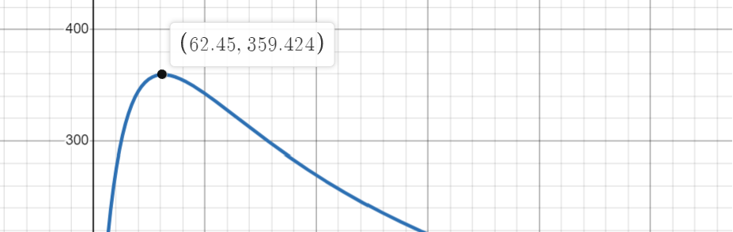

//main image here
# American Sign Language Glove

The ASL Glove is capable of translating physical hand gestures representing the ASL alphabet into text. We use the
Arduino Nano 33 BLE Sense Rev 2 to get data from flex sensors (resistors), an accelerometer, and a gyroscope. This data
is sent through Serial to a computer and fed into a Python KNN algorithm to make a prediction for the current character. Finally, we show the
text through an on-glove LCD screen and a custom Bluetooth Low Energy App. This
repository aims to give an in-depth analysis of our design choices, how the glove works, and how to make your own.


## Alphabet

As we can see, most of the characters in the ASL alphabet can be predicted by the individual multisets (5)
containing the relative position of {joints and phalanges} for each finger. Unfortunately, such measurements would
require a lot of expensive and very precise sensors. However, we can approximate these multisets as the individual "flexness"
of all fingers and add an extra "flexness" value to the back of the hand.
It is important to note that it is possible for two different multisets of a finger to output
the same "flexness" value, but we assume this to be: (a) unlikely and (b) negligible when taking into account the rest of
the other fingers' measurements. For measuring this "flexness," we use [Adafruit's short flex sensors](https://www.adafruit.com/product/1070).

Sadly, flex sensors alone will not be enough to accurately predict all charracters. Some letters share the same multiset of
relative positions but the fingers are simply: (a) oriented differently, (b) in motion, or (c) spaced differently.
We can fix (a) and (b) by using an accelerometer, this would allow us to effectively have the equivalent of an absolute position multiset,
but there's not much we can do about (c).

## Arduino Nano 33 BLE Sense Rev 2
While it is true that any Arduino can perform `analogRead`s (for flex sensors), we need something that is small and wearable. This limits our options
mostly to Arduino Nanos. When considering that we are also in need of an accelerometer, and that we want to show predictions on a custom app through Bluetooth,
we can see that the [Arduino Nano 33 BLE Sense Rev2](https://docs.arduino.cc/hardware/nano-33-ble-sense-rev2) is a good choice. Additionally,
while we initially did not have a prefrence of Low Energy over Standard Bluetooth, since this microcontroller uses BLE, is low power, and works on a 3.3v logic,
it is perfect to eventually implement on-glove predictions and power, without the need of a computer.


## Flex Sensors

The easiest way to get data from the flex sensors is to map the resistance to a number by using `analogRead`. This function maps a [0, 3.3] voltage to a [0, 1023] value.
While Arduino cannot directly measure resistance, we can read the `v_out` from a voltage divider made up of a flex sensor and an extra resistance. The function we want to maximaze is:

$$f\left(R\right)=\left(\frac{R}{R_{Flex-}+R}-\frac{R}{R_{Flex+}+R}\right)1024$$

Where:<br>
`f` is the range of values we can get from `analogRead`<br>
`-` and `+` represent the lower and upper bound of the flex sensor<br>
`R` is the extra resistance we are looking for

Looking at the [datasheet](https://cdn-shop.adafruit.com/datasheets/SpectraFlex2inch.pdf) we see an expected flat resitance of 25 kΩ and max bent resistance of 125 kΩ.
Using a multimeter we double check the values, finding an actual range of [30, 130] kΩ in our case.
We could take the derivative with respect to R to find the roots of the function, but it is not necessary if using [Desmos](https://www.desmos.com/calculator).
By inspection we see that the optimal value of `R` is 62.45 kΩ. Since we did not have that specific resistance, we built a `R_eq` of 60 kΩ, very close to the target.



We repeat this circuit for the back of the hand and each finger (6) which are read by [`A0`..., `A4`, `A5`], respectively.
```C++
short fingers[6];

    ...

  fingers[0] = analogRead(A0);
  fingers[1] = analogRead(A1);
  fingers[2] = analogRead(A2);
  fingers[3] = analogRead(A3);
  fingers[4] = analogRead(A6);
  fingers[5] = analogRead(A7);
```

## Commandsx

## Bill of Materials
+ Glove
+ [Arduino Nano 33 BLE Sense Rev2](https://docs.arduino.cc/hardware/nano-33-ble-sense-rev2)
+ [Short Flex Sensors](https://www.adafruit.com/product/1070) (6)
+ [I²C LCD](https://projecthub.arduino.cc/arduino_uno_guy/i2c-liquid-crystal-displays-5eb615)
+ Extra resistor `R`
+ Breadboard/protoboard
+ Jumpers
+ Computer (KNN, power)
