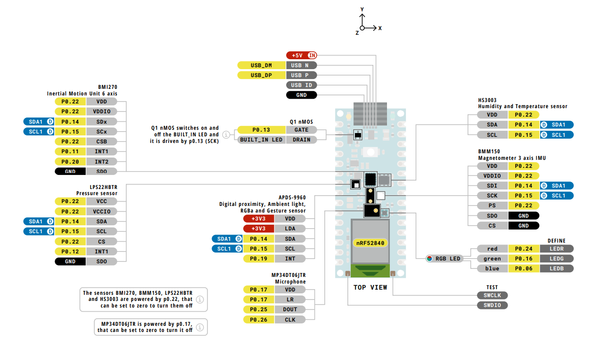
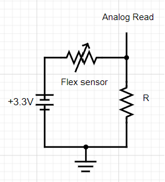
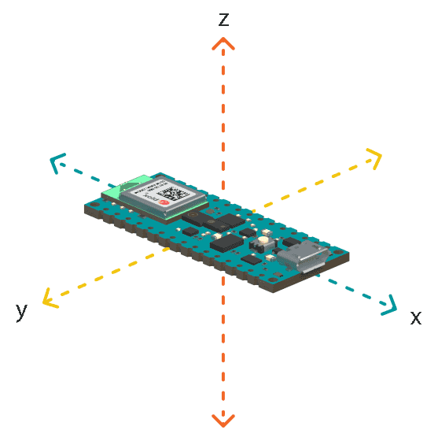

//main image here
# American Sign Language Glove

The ASL Glove is capable of translating physical hand gestures representing the ASL alphabet into text. We use the
Arduino Nano 33 BLE Sense Rev2 to get data from flex sensors (resistors), an accelerometer, and a gyroscope. This data
is sent through Serial to a computer and fed into a Python KNN algorithm to make a prediction for the current character. Finally, we show the
text through an on-glove LCD screen and a custom Bluetooth Low Energy App. This
repository aims to give a more in-depth analysis of our design choices, how the glove works, and how you can make your own.


## Alphabet

As we can see, most of the characters in the ASL alphabet can be predicted by the individual multisets (5)
containing the relative position of {joints and phalanges} for each finger. Unfortunately, such measurements would
require a lot of expensive and very precise sensors. However, we can approximate these multisets as the individual "flexness"
of all fingers and add an extra "flexness" value to the back of the hand.
It is important to note that it is possible for two different multisets of a finger to map to 
the same "flexness" value ([surjective](https://en.wikipedia.org/wiki/Surjective_function)), but we assume this to be: (a) unlikely and (b) negligible when taking into account the rest of
the other fingers' measurements. For measuring this "flexness," we use [Adafruit's short flex sensors](https://www.adafruit.com/product/1070).

Sadly, flex sensors alone will not be enough to accurately predict all charracters. Some letters share the same multiset of
relative positions but the fingers are simply: (a) oriented differently, (b) in motion, or (c) spaced differently.
We can fix (a) and (b) by using an accelerometer, this would allow us to effectively have the equivalent of a position multiset with absolute orientation,
but there's not much we can do about (c).

## Arduino Nano 33 BLE Sense Rev 2
While it is true that any Arduino can perform `analogRead`s (for flex sensors), we need something that is small and wearable. This limits our options
mostly to Arduino Nanos. When considering that we are also in need of an accelerometer, and that we want to show predictions on a custom app through Bluetooth,
we can see that the [Arduino Nano 33 BLE Sense Rev2](https://docs.arduino.cc/hardware/nano-33-ble-sense-rev2) is a good choice. Additionally,
while we initially did not have a prefrence of Low Energy over Standard Bluetooth, since this microcontroller uses BLE, is low power, and works on a 3.3v logic,
it is perfect to eventually implement on-glove predictions and power, without the need of a computer.



## Flex Sensors


The easiest way to get data from the flex sensors is to map the resistance to a number by using `analogRead`. This function maps a [0, 3.3] voltage to a [0, 1023] value.
While Arduino cannot directly measure resistance, we can read the `v_out` from a voltage divider made up of a flex sensor and an extra resistance. The function we want to optimize is:

$$f\left(R\right)=\left(\frac{R}{R_{Flex-}+R}-\frac{R}{R_{Flex+}+R}\right)1024$$

Where:<br>
`f` is the range of values we can get from `analogRead`<br>
`-` and `+` represent the lower and upper bounds of the flex sensor<br>
`R` is the extra resistance we are looking for

Looking at the [datasheet](https://cdn-shop.adafruit.com/datasheets/SpectraFlex2inch.pdf) we see an expected flat resitance of 25 kΩ and max bent resistance of 125 kΩ.
Using a multimeter we double-check the values, finding an actual range of [30, 130] kΩ in our case.
We could take the derivative with respect to R to find the roots of the function, but it is not necessary if using [Desmos](https://www.desmos.com/calculator).
By inspection, we see that the optimal value of `R` is 62.45 kΩ. Since we did not have that specific resistance, we built a `R_eq` of 60 kΩ, very close to the target.


We repeat this circuit for the back of the hand and each finger (6) which are read by [`A0`..., `A4`, `A5`], respectively.
```C++
short fingers[6];

    ...

  fingers[0] = analogRead(A0);
  fingers[1] = analogRead(A1);
  fingers[2] = analogRead(A2);
  fingers[3] = analogRead(A3);
  fingers[4] = analogRead(A6);
  fingers[5] = analogRead(A7);
```

## Accelerometer


The interesting thing about the accelerometer is that it does not measure coordinate acceleration but rather [proper acceleration](https://en.wikipedia.org/wiki/Proper_acceleration).
This means that, even when the accelerometer is in uniform motion (`a` = 0) it still measures the [standard gravitational acceleration](https://en.wikipedia.org/wiki/Standard_gravity).
Knowing this, we can measure the fraction of earth's gravitational acceleration that projects onto a given axis (aka [dot product](https://en.wikipedia.org/wiki/Dot_product)).
Furthermore, if we take the inverse cosine `cos-¹(a)` we can get the angle `θ` relative to the gravitational acceleration vector. In our case, we simply set a constant `PARALEL_AXIS_THRESHOLD_G = 0.8`, 
which is the minimum value of the projection onto that axis. This would be the equivalent of:

$$\theta<\cos^{-1}\left(0.8\right)$$

$$\theta<36.869...°$$

What we can do is, for instance, since `l`, `g`, and `q` are pretty much the same (to the flex sensors), instead of training the [KNN](https://github.com/GioByte10/American-Sign-Language-Glove/tree/main#knn) on those 3 different letters, we can have it train in only one of them, let's say `l`.
Now, when we get a prediction saying the current character is `l` we also check the values of the `x` and `z` axis to see if it is actually a `l`, `g`, or `q`.
```python
match prediction:
    case 'l':
        if abs(arr[X_AXIS_G]) > PARALEL_AXIS_THRESHOLD_G:
            prediction = 'g'
        elif abs(arr[Z_AXIS_G]) > PARALEL_AXIS_THRESHOLD_G:
            prediction = 'q'

    case 'k':
        if not abs(arr[Y_AXIS_G]) > PARALEL_AXIS_THRESHOLD_G:
            prediction = 'p'

    case 'u' | 'v':
        if abs(arr[X_AXIS_G]) > PARALEL_AXIS_THRESHOLD_G:
            prediction = 'h'
```

We can do something similar for the letters that are the same but  in motion, for instance, `d` and `z`. In this case we measure that the standard gavitational acceleration drops when we move the hand downwards. 
Here `LINEAR_THRESHOLD_G = -0.5`.

```python
if np.max(linear_acc) > LINEAR_THRESHOLD_G:
    match prediction:
        case 'd':
            prediction = 'z'

        case 'i':
            prediction = 'j'
```
## Commands
While showing a letter on the LCD/App of the current prediction is already great, we also want to be able to spell and form words/sentences. 
So far our prediction is based on the instantaneous values of the flex sensors and accelerometer data. We need a way to tell Python when to _poll_ a character. 
That is, we need a way to know when to append a letter to a sentence. We might make mistakes when trying to spell too, so being able to delete single characters or an entire sentence would be useful as well. 
Spaces would also be neat so that we can seprate words. Fortunately, the Arduino Nano 33 BLE Sense Rev2 is also equipped with a gyroscope. This sensor measures the degrees per second (DPS) `ω` of a given axis:

$$ω=\frac{d}{dt}\left(\alpha\right)$$

What we can do is use this data to perform these _commands_. We chose angular motion in:<br>
`x` axis to add a `space`<br>
`y` axis to `append` letters<br>
`z` axis to `delete` a character. Three deletions in a row delete the entire sentence<br>

// add gifs

We can select appropiate values by inspection:
```python
ADD_THRESHOLD_DPS = 220
DELETE_THRESHOLD_DPS = 300
SPACE_THRESHOLD_DPS = 220
```

## communicate.py
We have been talking about how we can use the values from the flex sensors, accelerometer, and gyroscope, but we are still yet to talk about how we will communicate between the Arduino and the KNN. 
[communicate.py](https://github.com/GioByte10/American-Sign-Language-Glove/blob/main/KNN/production/communicate.py) gets this job done. The Arduino communicates to the computer via Serial 
sending a comma separated string of the flex sensors, accelerometer, and gyroscope. We use [pyserial](https://pythonhosted.org/pyserial/) for Python to read the data. We load the Arduino `Port` and KNN model `PATH` from a `data.json` file.

Inside our main `while` loop we read the Arduino Serial data every 100 ms where we decode it, separate the values, and put into an list. Once in this list, we convert it into an array and average the last 15 values of the flex sensors to send to the KNN model. After we get a prediction, a message is sent to the Arduino to represent the command/action we want it to take. The message has the following structure:
```python
sendMsg = prediction + ',' + command
```

From here four different things can happen:<br>
if `command` is an empty character, the Arduino shows the instantaneous prediction<br>
if `command` is the same as `prediction`, the letter is appended to a sentence<br>
if `command` is `*`, we delete a character<br>
if `command` is `!`, we delete the sentence<br>
if `command` is ` `, we add a space<br>

## Arduino_ASL.ino
Now that we talked about what runs on the computer, let's talk about the embedded side. [Arduino_ASL.ino](blank) is what runs on the board. 
We can see how we are setting up our main pheripherals, sensors, and communication protocols in `setup`. These are: (ab) the built-in LED, (b) `Serial`, (c) [IMU](https://en.wikipedia.org/wiki/Inertial_measurement_unit), (accelerometer and gyroscope), (d) `lcd`, and (e) `BLE`.

```C++
void setup() {

  pinMode(LED_BUILTIN, OUTPUT);

  Serial.begin(115200);
  Serial.println("Started");

  if(!IMU.begin()){
    Serial.println("IMU failed to initialize");
    while(1);
  }

  Serial.println("IMU ON");

  lcd.init();
  lcd.backlight();
  lcd.home();
  lcd.print("Waiting...");

  BLE.begin();
  BLE.setDeviceName("Nano_33_BLE");
  BLE.setLocalName("Nano_33_BLE");

  BLE.setAdvertisedService(messageService);
  messageService.addCharacteristic(messageCharacteristic);

  BLE.addService(messageService);
  messageCharacteristic.writeValue(message);

  BLE.advertise();
  delay(6000);
}
```


## KNN


## Bill of Materials
+ Glove
+ [Arduino Nano 33 BLE Sense Rev2](https://docs.arduino.cc/hardware/nano-33-ble-sense-rev2)
+ [Short Flex Sensors](https://www.adafruit.com/product/1070) (6)
+ [I²C LCD](https://projecthub.arduino.cc/arduino_uno_guy/i2c-liquid-crystal-displays-5eb615)
+ Extra resistor `R`
+ Breadboard/protoboard
+ Jumpers
+ Computer (KNN, power)

## Acknowledgements
Description of what each of us did  + what language we translated

# American Sing Language Glove (Spanish)


# American Sing Language Glove (Japanese)


# American Sing Language Glove (Chinese)

 
